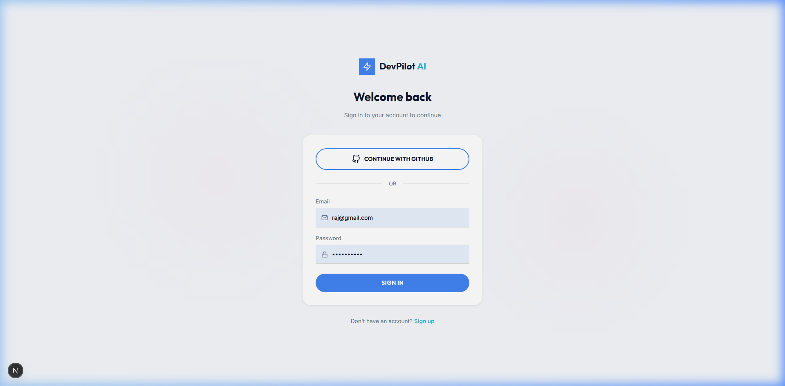
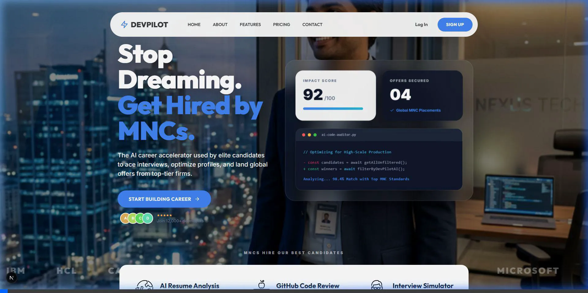

<div align="center">

# ⚡ DevPilot AI

### *Your AI-Powered Career Co-Pilot for Indian Developers*

**The only platform that analyzes your resume, reviews your GitHub, simulates interviews, and matches you with jobs — all in one place, powered by AI.**

[](https://devpilot.ai)
[](https://devpilot.ai/waitlist)
[](https://github.com/Rajhalder123/DevPilot-AI)
[](LICENSE)

[](https://nodejs.org)
[](https://nextjs.org)
[](https://typescriptlang.org)
[](https://mongodb.com/atlas)
[](https://groq.com)

---

> 🇮🇳 **Built for India's 2 million+ engineering graduates** entering the job market every year with no guidance, weak resumes, and scattered job search strategies.

</div>

---

## 🖼️ Real Screenshots (Live Build)

### 🏠 Landing Page — *"Stop Dreaming. Get Hired by MNCs."*


### 🔐 Login / Authentication — Email + GitHub OAuth



### 🎬 Live Demo Recording



### 📊 All 10 Dashboard Modules — Run Locally at `localhost:3000`

| Module                | Route                      | What You'll See                     |
| --------------------- | -------------------------- | ----------------------------------- |
| 🏠 Dashboard Home      | `/dashboard`               | Stats overview + 8 quick actions    |
| 📄 Resume Analyzer     | `/dashboard/resume`        | PDF upload + ATS score              |
| 🔬 GitHub Analyzer     | `/dashboard/github`        | Repo URL → code quality score       |
| 🎙️ Interview Simulator | `/dashboard/interview`     | Voice-enabled AI interview          |
| 🔎 Job Matcher         | `/dashboard/jobs`          | 6 AI-curated job recommendations    |
| 💬 Career Mentor       | `/dashboard/career-mentor` | AI chat, quick questions            |
| 🎯 Job Ready Score     | `/dashboard/job-ready`     | Animated circular gauge + breakdown |
| 🗺️ Career Roadmap      | `/dashboard/roadmap`       | Role selector → phased timeline     |
| 🌐 Portfolio Builder   | `/dashboard/portfolio`     | Form → AI-generated HTML site       |
| ✉️ Cover Letter        | `/dashboard/cover-letter`  | Resume + JD → instant letter        |

---

## 😤 The Problem

Every year, **2+ million engineers graduate in India** — and most of them face the same brutal experience:

| Problem                                  | Reality                                                  |
| ---------------------------------------- | -------------------------------------------------------- |
| 📄 **Resume rejected by ATS**             | 75% of resumes never reach a human recruiter             |
| 🔍 **No idea what skills companies want** | Syllabus-focused education ≠ industry requirements       |
| 🧑‍💻 **Weak GitHub / no projects**          | Recruiters check GitHub before calling                   |
| 😨 **Never practiced real interviews**    | Campus mock interviews are slow and expensive            |
| 🗂️ **Jobs spread across 10 platforms**    | LinkedIn, Naukri, Internshala, Indeed, Wellfound...      |
| 🤷 **No career guidance**                 | Career counselors are either unavailable or unaffordable |

> **The result?** Months of rejections, wasted applications, and frustrated graduates who never know *why* they aren't getting calls.

---

## ✅ The Solution

**DevPilot AI** is a **single unified platform** that gives every Indian graduate access to:

- 🤖 **AI that reads your resume** like an ATS does and tells you exactly what to fix
- 🔬 **AI that reviews your GitHub code** so you know what projects to improve
- 🎙️ **A voice-enabled AI interviewer** that asks real questions and scores you
- 📊 **A "Job Ready Score"** — one number that tells you how hireable you are today
- 🗺️ **A personalized learning roadmap** based on your target role
- 🌐 **A portfolio generator** that creates a deployable website from your info
- 💬 **An AI career mentor** trained on Indian IT job market patterns
- 🔎 **AI-matched job recommendations** based on your actual skill profile

---

## 🏆 Why DevPilot AI is Different

Most platforms do **one thing**. DevPilot AI does **everything**.

| Feature                   |    DevPilot AI    | LinkedIn | Naukri | Resume.io |
| ------------------------- | :---------------: | :------: | :----: | :-------: |
| ATS Resume Scoring        |   ✅ AI-powered    |    ❌     |   ❌    |  Limited  |
| GitHub Code Review        |   ✅ AI-powered    |    ❌     |   ❌    |     ❌     |
| AI Mock Interview (Voice) |    ✅ Real-time    |    ❌     |   ❌    |     ❌     |
| Job Ready Score           |    ✅ Weighted     |    ❌     |   ❌    |     ❌     |
| AI Career Mentor          | ✅ India-specific  |    ❌     |   ❌    |     ❌     |
| Portfolio Generator       |  ✅ AI-generated   |    ❌     |   ❌    |     ❌     |
| Career Roadmap            | ✅ AI-personalized |    ❌     |   ❌    |     ❌     |
| Free Tier                 |         ✅         |    ✅     |   ✅    |  Limited  |

---

## 🧠 Core Modules (9 Total)

<details>
<summary><b>📄 1. Resume ATS Analyzer</b></summary>

Upload your PDF resume → AI gives you:
- **ATS Score** (0–100) — how well you pass automated filters
- **Missing Keywords** — skills recruiters are searching for
- **Formatting Issues** — what ATS bots can't parse
- **Measurable Achievement Tips** — how to quantify your experience
- **Specific Improvement Actions** — not vague advice, exact rewrites

</details>

<details>
<summary><b>🔬 2. GitHub Project Analyzer</b></summary>

Paste your GitHub repo URL → AI reviews:
- **Code Quality Score** (0–100)
- **Architecture Assessment** — folder structure, separation of concerns
- **README quality** — does it explain the project clearly?
- **Missing best practices** — tests, deployment, CI/CD
- **Concrete improvements** — what to add before sending to recruiters

</details>

<details>
<summary><b>🎙️ 3. AI Interview Simulator (with Voice)</b></summary>

- Real-time conversation via **WebSocket** — zero lag
- **Speech-to-Text** input (browser native, no cost)
- **Text-to-Speech** AI responses — sounds like a real interviewer
- Supports: Technical, Behavioral, System Design rounds
- Difficulty levels: Easy, Medium, Hard
- Final score + detailed feedback after session
- Auto-stop when you navigate away

</details>

<details>
<summary><b>🎯 4. Job Ready Score</b></summary>

One number that tells you how hireable you are. See the scoring breakdown below.

</details>

<details>
<summary><b>🔎 5. AI Job Matcher</b></summary>

- Based on your skills + resume, AI recommends **6 curated jobs**
- Each job includes: company, role, location, salary range, match %
- Reduces time wasted applying to irrelevant positions

</details>

<details>
<summary><b>✉️ 6. Cover Letter Generator</b></summary>

- Input: your resume + job description + company name
- Output: a personalized, ATS-optimized cover letter in seconds
- Tone selection: Professional / Enthusiastic / Concise

</details>

<details>
<summary><b>💬 7. AI Career Mentor</b></summary>

Chat with an AI trained specifically on **Indian IT career patterns**:
- How to get into TCS, Infosys, Wipro, startups, MNCs
- Off-campus strategies, LinkedIn optimization
- What projects to build for each role
- Free learning resources ranked by effectiveness

</details>

<details>
<summary><b>🗺️ 8. Career Roadmap Generator</b></summary>

- Select target role (Frontend, Backend, Data Science, DevOps, etc.)
- Enter current skills
- Get a **phased timeline** with skills, resources, and priorities
- Covers 12 career tracks

</details>

<details>
<summary><b>🌐 9. Portfolio Builder</b></summary>

- Fill a simple form (name, bio, skills, projects, links)
- AI generates a **complete portfolio website** with premium dark-themed design
- Download as single HTML file — host anywhere for free
- No coding knowledge needed

</details>

---

## 📊 How the Job Ready Score Works

The **Job Ready Score** is a weighted algorithm that gives you one clear number:

```
┌─────────────────────────────────────────────────────┐
│              📊 JOB READY SCORE BREAKDOWN           │
├──────────────────────────┬──────────┬───────────────┤
│  Component               │ Weight   │ How to Improve│
├──────────────────────────┼──────────┼───────────────┤
│  📄 Resume Quality       │  30%     │ Use Analyzer  │
│  🔬 GitHub Projects      │  25%     │ Analyze Repos │
│  🎙️ Interview Performance│  25%     │ Do Mock Rounds│
│  🛠️ Skill Completeness   │  10%     │ Update Profile│
│  📁 Project Count        │  10%     │ Add Projects  │
└──────────────────────────┴──────────┴───────────────┘
```

**Score Ranges:**
- 🔴 `0–39%` — Just Starting — Focus on fundamentals
- 🟠 `40–59%` — Needs Work — Build projects + improve resume
- 🟡 `60–79%` — Getting There — Practice interviews
- 🟢 `80–100%` — Job Ready — Start applying confidently!

> 💡 **Viral Feature:** Share `"My Job Ready Score: 78% 🚀 — Check yours at DevPilot AI"` directly to LinkedIn.

---

## 🚶 User Journey

```
Step 1 → Sign Up (email or GitHub OAuth)
   │
Step 2 → Upload Resume (PDF drag-and-drop)
   │         └─ AI scores it instantly
   │
Step 3 → Connect GitHub (paste repo URL)
   │         └─ AI reviews code quality
   │
Step 4 → View Job Ready Score
   │         └─ See exactly where you stand
   │
Step 5 → Practice Interview
   │         └─ Voice AI interviewer, real questions
   │
Step 6 → Get Career Roadmap
   │         └─ Personalized learning path
   │
Step 7 → Apply for AI-Matched Jobs
            └─ Curated roles based on your profile
```

---

## 🏗️ System Architecture

```
┌─────────────────────────────────────────────────────────┐
│                      CLIENT (Browser)                   │
│           Next.js 16  ·  React 19  ·  TypeScript        │
│         Framer Motion · Socket.IO Client · Axios        │
└──────────────────────────┬──────────────────────────────┘
                           │ HTTPS + WSS
┌──────────────────────────▼──────────────────────────────┐
│                  NODE.JS BACKEND (Express)               │
│                                                         │
│  ┌─────────────┐  ┌──────────────┐  ┌───────────────┐  │
│  │  REST API   │  │  Socket.IO   │  │  Middleware   │  │
│  │  (11 routes)│  │  (Interview) │  │  JWT · CORS  │  │
│  └──────┬──────┘  └──────┬───────┘  └───────────────┘  │
│         │                │                              │
│  ┌──────▼────────────────▼──────────────────────────┐  │
│  │               SERVICE LAYER                       │  │
│  │  openai.ts ─ github.ts ─ pdf-parse ─ multer      │  │
│  └──────┬────────────────────────────────────────────┘  │
└─────────┼───────────────────────────────────────────────┘
          │
    ┌─────▼──────┐    ┌──────────────┐    ┌─────────────┐
    │  Groq AI   │    │   MongoDB    │    │  GitHub API │
    │ Llama 3.3  │    │    Atlas     │    │  REST v3    │
    │   70B      │    │  (5 models) │    │             │
    └────────────┘    └──────────────┘    └─────────────┘
```

---

## 🧱 Tech Stack

### Frontend
| Package               | Version | Use                               |
| --------------------- | ------- | --------------------------------- |
| `next`                | 16.1.6  | React framework, App Router, SSR  |
| `react`               | 19.2.3  | UI library                        |
| `framer-motion`       | 12.x    | Animations, transitions, gestures |
| `socket.io-client`    | 4.x     | Real-time interview WebSocket     |
| `react-dropzone`      | 15.x    | Drag-and-drop PDF upload          |
| `react-icons`         | 5.x     | Feather Icons, Font Awesome       |
| `react-fast-marquee`  | 1.x     | Scrolling ticker banners          |
| `react-parallax-tilt` | 1.x     | 3D card tilt effects              |
| `axios`               | 1.x     | HTTP client with JWT headers      |
| `tailwindcss`         | 4.x     | Base CSS resets                   |

### Backend
| Package              | Version | Use                             |
| -------------------- | ------- | ------------------------------- |
| `express`            | 4.x     | HTTP server + routing           |
| `mongoose`           | 8.x     | MongoDB ODM                     |
| `socket.io`          | 4.x     | WebSocket interview engine      |
| `openai`             | 4.x     | Groq AI SDK (OpenAI-compatible) |
| `jsonwebtoken`       | 9.x     | JWT auth tokens                 |
| `bcryptjs`           | 2.x     | Password hashing (12 rounds)    |
| `multer`             | 1.x     | File upload handling            |
| `pdf-parse`          | 1.x     | Extract text from PDF           |
| `helmet`             | 8.x     | HTTP security headers           |
| `cors`               | 2.x     | Cross-origin policy             |
| `morgan`             | 1.x     | Request logging                 |
| `express-rate-limit` | 7.x     | API rate limiting               |
| `axios`              | 1.x     | GitHub API client               |

### AI & External Services
| Service                    | Purpose                                             |
| -------------------------- | --------------------------------------------------- |
| **Groq (Llama 3.3 70B)**   | All AI features — free, ultra-fast inference        |
| **GitHub REST API v3**     | Repo metadata, README, language detection           |
| **GitHub OAuth 2.0**       | Social login                                        |
| **Browser Web Speech API** | STT + TTS for voice interview (free, no extra cost) |

---

## 🔌 Full API Reference

```
POST   /api/auth/signup              Register new user
POST   /api/auth/login               Login, returns JWT
GET    /api/auth/github              GitHub OAuth redirect
GET    /api/auth/github/callback     GitHub OAuth callback
GET    /api/auth/me                  Get current user (JWT required)
PUT    /api/auth/profile             Update name, bio, skills

POST   /api/resume/upload            Upload PDF (Multer → pdf-parse)
POST   /api/resume/analyze           AI ATS analysis (Groq)
GET    /api/resume/history           Past resume analyses

POST   /api/github/analyze           Analyze a GitHub repo by URL
GET    /api/github/history           Past GitHub reviews

POST   /api/interview/sessions       Create interview session
WS     interview:message             Send msg → AI responds (real-time)
DELETE /api/interview/sessions/:id   End session

POST   /api/jobs/recommend           Get 6 AI job recommendations
POST   /api/cover-letter/generate    Generate personalized cover letter

POST   /api/career-mentor/chat       AI career mentor chat (with history)
GET    /api/job-ready-score          Weighted career readiness score
POST   /api/roadmap/generate         Phased career roadmap generation
POST   /api/portfolio/generate       Full portfolio HTML generation

GET    /api/dashboard/stats          Resume count, interview score, etc.
GET    /api/health                   Server health check
```

---

## 🗄️ Database Collections

```
users             name, email, password (bcrypt), githubId, skills[], bio
resumes           userId, fileName, extractedText, analysis{}, atsScore
githubprojects    userId, repoUrl, repoName, analysis{}, overallScore
interviewsessions userId, topic, difficulty, messages[], score, status
jobmatches        userId, recommendations[], createdAt
```

---

## ⚙️ Environment Variables

**`backend/.env`**
```env
PORT=5000
NODE_ENV=development
MONGODB_URI=mongodb+srv://<user>:<pass>@cluster.mongodb.net/devpilot
JWT_SECRET=your-super-secret-key-min-32-chars
JWT_EXPIRES_IN=7d
GROQ_API_KEY=gsk_...            # Free at console.groq.com
GITHUB_CLIENT_ID=...            # From github.com/settings/developers
GITHUB_CLIENT_SECRET=...
GITHUB_CALLBACK_URL=http://localhost:5000/api/auth/github/callback
FRONTEND_URL=http://localhost:3000
```

**`frontend/.env.local`**
```env
NEXT_PUBLIC_API_URL=http://localhost:5000/api
NEXT_PUBLIC_SOCKET_URL=http://localhost:5000
```

---

## 🚀 Getting Started (5 Minutes)

### Prerequisites
- Node.js 18+
- MongoDB Atlas account (free tier works)
- Groq API key → [console.groq.com](https://console.groq.com) *(free)*

```bash
# 1. Clone the repo
git clone https://github.com/Rajhalder123/DevPilot-AI.git
cd DevPilot-AI

# 2. Set up backend
cd backend
npm install
cp .env.example .env    # Fill in your values
npm run dev             # Starts at http://localhost:5000

# 3. Set up frontend (new terminal)
cd ../frontend
npm install
# Create frontend/.env.local with your values
npm run dev             # Starts at http://localhost:3000
```

---

## 💰 Monetization — SaaS Pricing

DevPilot AI uses a **freemium model** — cost can't be a barrier for Indian students:

|                         | 🆓 Free  | 🎓 Pro Student ₹99/mo | 🚀 Pro Plus ₹249/mo |
| ----------------------- | :-----: | :------------------: | :----------------: |
| Resume Analyses         | 3/month |     ♾️ Unlimited      |    ♾️ Unlimited     |
| GitHub Reviews          | 1/month |     ♾️ Unlimited      |    ♾️ Unlimited     |
| Interview Sessions      | 2/month |     ♾️ Unlimited      |    ♾️ Unlimited     |
| Voice Interview         |    ❌    |          ✅           |         ✅          |
| AI Career Mentor        | Limited |          ✅           |         ✅          |
| Cover Letter            |    ❌    |          ✅           |         ✅          |
| Job Ready Score         |    ✅    |          ✅           |         ✅          |
| Career Roadmap          |    ✅    |          ✅           |         ✅          |
| Portfolio Builder       |    ✅    |          ✅           |         ✅          |
| Advanced AI Coaching    |    ❌    |          ❌           |         ✅          |
| LinkedIn Profile Review |    ❌    |          ❌           |         ✅          |
| Priority Support        |    ❌    |          ❌           |         ✅          |

**Why this pricing works:**
- ₹99/month = less than a single coaching session
- Free tier creates viral top-of-funnel — students share their Job Ready Score on LinkedIn
- Pro conversion happens naturally when students get results

---

## 📈 Growth Vision — Road to 100K Users

**Viral Loop:**
> User gets Job Ready Score → Shares `"My score is 78% 🚀"` on LinkedIn → Friends sign up → More users → Better AI

**Growth Channels:**

| Channel       | Strategy                                               |
| ------------- | ------------------------------------------------------ |
| 📢 LinkedIn    | Students share score cards, mentor conversations       |
| 💬 Telegram    | Indian developer job groups (500K+ combined members)   |
| 🎓 Colleges    | Partner with CSE departments for free placement tools  |
| 📺 YouTube     | Demo: "I let AI review my resume + GitHub for 30 days" |
| 🤝 Communities | Reddit (r/indianprogrammers), Discord servers          |

---

## 🔮 Roadmap

```
Phase 1 — ✅ MVP (COMPLETE)
  ✅ Resume Analyzer         ✅ GitHub Reviewer
  ✅ Interview Simulator     ✅ Job Matcher
  ✅ Career Mentor Chat      ✅ Job Ready Score
  ✅ Career Roadmap          ✅ Portfolio Builder

Phase 2 — AI Enhancement
  🔲 Real-time coding interviews (shared code editor)
  🔲 Multi-round interview simulation
  🔲 Behavioral interview scoring with sentiment analysis
  🔲 AI resume rewriting (not just scoring)

Phase 3 — Job Engine
  🔲 Live job scraper (LinkedIn, Naukri, Internshala, Wellfound)
  🔲 Daily email + Telegram job alerts
  🔲 One-click apply integration
  🔲 Application tracker (know where you applied)

Phase 4 — Recruiter Platform
  🔲 Company hiring dashboard
  🔲 Recruiter marketplace — browse verified student profiles
  🔲 AI candidate matching for HR teams
  🔲 Skill assessment certifications

Phase 5 — AI Hiring Assistant
  🔲 AI auto-apply to matching jobs
  🔲 Follow-up email drafter
  🔲 Salary negotiation coach
  🔲 Offer comparison tool
```

---

## 📐 Scalability Plan (100K+ Users)

```
Current (MVP)                    At Scale
─────────────────                ─────────────────────────────────
Single Node.js server    →       Horizontal auto-scaling (AWS ECS)
Synchronous AI calls     →       Redis queue workers (Bull/BullMQ)
Direct MongoDB queries   →       Redis caching layer
Static assets served     →       CDN (Cloudflare)
Monolithic backend       →       Microservices AI layer
Single region            →       Multi-region (Mumbai + Singapore)
```

- **AI latency** → Queue AI jobs, return job ID, show progress spinner
- **Resume parsing** → Background worker queue with status polling
- **Database** → MongoDB Atlas auto-scaling + read replicas
- **WebSocket** → Socket.IO with Redis adapter for multi-node

---

## 🤝 Contributing

Every contribution helps a real student get a job faster.

### How to Contribute
- 🐛 **Bug reports** → Open a GitHub Issue
- 💡 **Feature ideas** → Start a Discussion
- 🔧 **Code** → Fork → Branch → PR
- 📝 **Docs** → Improve README or setup guides
- 📸 **Screenshots** → Add real dashboard screenshots to `docs/screenshots/`

```bash
git clone https://github.com/Rajhalder123/DevPilot-AI.git
git checkout -b feature/your-feature-name
# Make changes
git commit -m "feat: describe your change"
git push origin feature/your-feature-name
# Open a Pull Request on GitHub
```

**Standards:** TypeScript strict mode · ESLint · Try/catch on all API routes · Comments on complex logic

---

## 📁 Project Structure

```
DevPilot-AI/
├── backend/src/
│   ├── server.ts              # Express + Socket.IO bootstrap
│   ├── config/                # DB + env config
│   ├── middleware/            # JWT auth, error handler, rate limit
│   ├── models/                # 5 Mongoose schemas
│   ├── routes/                # 11 API route files
│   └── services/
│       ├── openai.ts          # 8 AI functions (Groq)
│       └── github.ts          # GitHub API client
│
├── frontend/src/
│   ├── app/
│   │   ├── page.tsx           # Landing page
│   │   ├── login/ signup/     # Auth pages
│   │   └── dashboard/         # 10 dashboard pages
│   ├── components/layout/     # Sidebar · Navbar · Layout
│   └── lib/                   # api.ts · auth.tsx
│
├── docs/screenshots/          # Real screenshots (landing, login, demo)
├── docker-compose.yml
├── .env.example
└── README.md
```

---

## 🔒 Security

| Layer             | Implementation                                          |
| ----------------- | ------------------------------------------------------- |
| **Auth**          | JWT (7-day expiry), `Authorization: Bearer <token>`     |
| **Passwords**     | BcryptJS — 12 salt rounds                               |
| **Headers**       | Helmet.js — XSS, HSTS, content-type sniffing protection |
| **CORS**          | Restricted to `FRONTEND_URL` env variable only          |
| **Rate Limiting** | Per-IP limits via `express-rate-limit`                  |
| **Uploads**       | Multer — 10MB max, PDF type validated                   |
| **AI Input**      | Sanitized before sending to Groq                        |

---

## 📄 License

MIT License — see [LICENSE](LICENSE) for details.
**Free to use, modify, and distribute.**

---

<div align="center">

## 🌟 Star This Repo

If DevPilot AI helps you or you believe in what we're building — **please star the repo**. It helps more Indian developers discover the platform.

[](https://github.com/Rajhalder123/DevPilot-AI)

---

**Built with ❤️ by Raj Halder — for every Indian developer who deserves a better shot at their first job.**

[🚀 Live Demo](https://devpilot.ai) · [📧 Contact](mailto:raj@devpilot.ai) · [💼 LinkedIn](https://linkedin.com/company/devpilot-ai)

</div>
